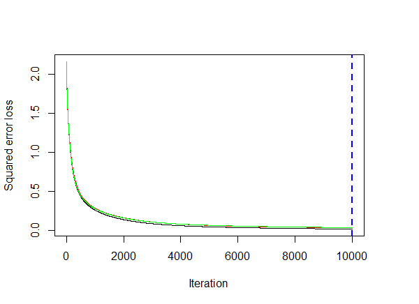
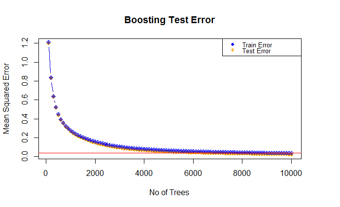
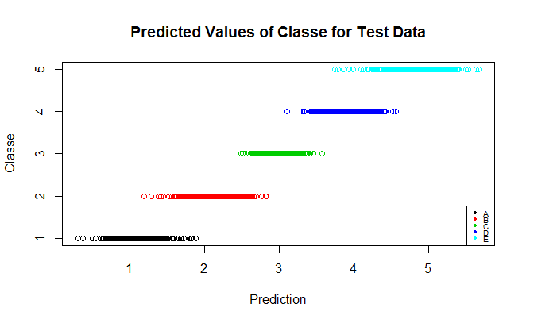
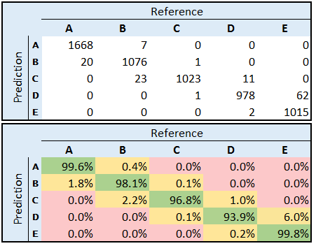

---
title: "Predicting Aspects of Human Activity using HAR Data"
author: "Ingrid Brady"
date: "Friday, September 25, 2015"
output: html_document
---  


### Introduction
  
In a growing world of devices such as phones, fitness devices and watches that can record detailed movement, the ability for machine learning to understand and classify those activities, so it can be used for a whole range of possibile uses in fitness, sport, health, weight loss and aged care.

The experiment done was, not just to predit what type of activity the participants were engaging in, but to detect how "well" the activity was performed i.e. to detect poor practice in execting certain movement which can result in safety issues when it relates to lifting weights, for example.  

In the words of the authors:  
_"The quality of execution and investigate three aspects that pertain to qualitative activity recognition: the problem of specifying correct execution, the automatic and robust detection of execution mistakes, and how to provide feedback on the quality of execution to the user."_

Six young health participants were asked to perform one set of 10 repetitions of the Unilateral Dumbbell Biceps Curl in five different fashions:   
* Exactly according to the specification (Class A)   
* Throwing the elbows to the front (Class B)   
* Lifting the dumbbell only halfway (Class C)  
* Lowering the dumbbell only halfway (Class D)  
* Throwing the hips to the front (Class E)   
  
  Data was collected via accelerometers attached to the participant.
  
Reference: Ugulino, W.; Cardador, D.; Vega, K.; Velloso, E.; Milidiu, R.; Fuks, H. Wearable Computing: Accelerometers' Data Classification of Body Postures and Movements. Proceedings of 21st Brazilian Symposium on Artificial Intelligence. Advances in Artificial Intelligence - SBIA 2012 Read more: !(http://groupware.les.inf.puc-rio.br/har#ixzz3mrrkjiQW)  

### Loading the Data & Selecting Predictors
```{r, eval=FALSE}
require(dplyr);  require(gbm);  require(caret); require(Metrics)
data.file <- "pml-training.csv"     # The training / validation data
tst.file <- "pml-testing.csv"       # The test dataset used for the final prediction
all.data <- read.csv(data.file, header=TRUE, sep=",", stringsAsFactors=FALSE)
data <- select(all.data, 7:11, 37:49, 60:68, 84:86, 102, 113:124, 140, 151:160)
train.rows <- sample(1:nrow(data), nrow(data)*0.7)
data$classe <- as.factor(data$classe)
```
   
***
      
### Developing the Model
The model that was selected was a Boosting model. The `gbm` package provides a comprehensive set of tools and parameters to tune the model and measure its performance and it is very successful at classification models.

Because Boosting does not require standardisation, no other pre-processing of the data wase use.   
Cross Validation was handled by a `gbm` parameter `cv.folds` and so 10 fold cross validation was specified.  
In addition, selection of the other tuning parameters was done as follows.   
* As there was likely interactions between predictors, `interaction.depth` was set to 4 to ensure that interaction between key predictors was done.    
* `shrinkage` was set to 0.01 which is a moderate level. This determines how aggressive the learning rate is.  
* All predictors, other than the first 6 columns, which contained row, id and time information were not used as they were thought to be highly correlated with other variables, and in some exploratory testing there were. While the first 5 influential predictors were significantly more influential that the rest, it was decided to include all predictors as on testing, they all had some influence.   
* The predictor `num_window` was included to provide and grouping of the individual measurements that made up a movement. The others were movement related accelerpmeter data.  
* `gbm` has a parameter `train.fraction` that allows specification of a fraction to be used as training and the remainder to be used internally as to calculate validation errors for providing information about model selection.  
* The most important parameter is the number of trees to build. Initially it was set at 10,000 so that error rates could be examined and the appropriate setting established.    

### Running the Model & Tuning
`gbm` is run with the selected parameters
```{r, eval=FALSE}
boost.data <- gbm(classe~., data=data[train.rows,], distribution="gaussian", 
                  n.trees=10000, interaction.depth=4, shrinkage=0.01, 
                  verbose=T, train.fraction=0.8, cv.folds=10)
```

The performance of the operation is available via `summary` and `gbm.perf` which give different information. Summary gives a Squared Error Loss plot (shown below) which shows the Means Sqd Error against the number of Tree build iterations, so assist with selection of that parameter. It also shows both it internal train and test errors for comparison. As can be seen from the plot, the curve flatted out around 10,000 and the output from gbm.perf also recommended with `cv` - 10,000, with `OOB` - 10,000 and with `test` - 9,999.   
So, 10,000 was selected as the parameter for `n.trees`.

```{r, eval=FALSE}
bsumm <- summary(boost.data)
bsumm
gbm.perf(boost.data,method="cv")
gbm.perf(boost.data,method="OOB")
gbm.perf(boost.data,method="test")
```



### Further Model Tuning
To further test the error rates in the model against the number of trees required, predictions were done against the training and test data sets and the result plotted.  
The levels of error, from test and training sets are very similar and the test error actually is slightly lower. Putting in a horizontal line at the minimum error confirmed that the curve had flattened at around 10,000 trees.

It also showed that test error was not increasing so that the model was not showing signs of overfitting.

```{r, eval=FALSE}
n.trees <- seq(from=100, to=10000, by=100 )
train.predmat <- predict(boost.data, newdata=data[train.rows,], n.trees=n.trees )
test.predmat <- predict(boost.data, newdata=data[-train.rows,], n.trees=n.trees )
      # then work out the column wise mean squared error for the prediction
train.err <- with(data[train.rows,], apply((train.predmat-as.numeric(classe))^2,2,mean))
test.err <- with(data[-train.rows,], apply((test.predmat-as.numeric(classe))^2,2,mean))
```

```{r, eval=FALSE}
plot(n.trees, train.err, pch=19, ylab="Mean Squared Error", xlab="No of Trees", 
     main="Boosting Test Error", col="orange", type="b")
lines(n.trees, test.err, pch=10, col="blue", type="b")
abline(h=min(test.err), col="red")
legend("topright", c("Train Error", "Test Error"), col=c("blue","orange"), 
       pch=c(19,10), cex=.6 )
```


### Test Prediction Results
```{r, eval=FALSE}
pred <- predict(boost.data, newdata=data[-train.rows,], n.trees=10000 )
classe <- as.numeric(data[-train.rows,54])
plot(pred, classe, col=classe, xlab="Prediction", ylab="Classe",
     main="Predicted Values of Classe for Test Data")
legend("bottomright", c("A", "B", "C", "D", "E"), col=c(1,2,3,4,5), 
       pch=c(19), cex=.6 )
```


Map predicted values back to the class and produce a confusion matrix to show the results. It showed a high level of overall accuracy of 97.8% and the confusion matrix showed a good level of accuracy. 

```{r, eval=FALSE}
pred2<-pred
pred2[pred2 <=1.5] <- 1
pred2[pred2>1.5] <- round(pred2[pred2>1.5])
pred2[pred2>5] <- 5
confusionMatrix(pred2, classe)

Confusion Matriz Overall Statistics
               Accuracy : 0.9784         
                 95% CI : (0.9744, 0.982)
    No Information Rate : 0.2867         
    P-Value [Acc > NIR] : < 2.2e-16                           
                  Kappa : 0.9727         
 Mcnemar's Test P-Value : NA             

Statistics by Class:
                     Class: 1 Class: 2 Class: 3 Class: 4 Class: 5
Sensitivity            0.9882   0.9729   0.9980   0.9869   0.9424
Specificity            0.9983   0.9956   0.9930   0.9871   0.9996
Pos Pred Value         0.9958   0.9809   0.9678   0.9395   0.9980
Neg Pred Value         0.9953   0.9937   0.9996   0.9973   0.9873
Prevalence             0.2867   0.1879   0.1741   0.1683   0.1829
Detection Rate         0.2833   0.1828   0.1738   0.1661   0.1724
Detection Prevalence   0.2845   0.1863   0.1795   0.1768   0.1728
Balanced Accuracy      0.9932   0.9842   0.9955   0.9870   0.9710
```




### Predicting against the assignment test data

```{r,eval=FALSE}
      # get the test data and select the same subset of predictors
tst.data <- read.csv(tst.file, header=TRUE, sep=",", stringsAsFactors=FALSE)
tdata <- select(tst.data, 7:11, 37:49, 60:68, 84:86, 102, 113:124, 140, 151:159)

```

```{r, eval=FALSE}
tdata$classe <- as.factor(tdata$classe)
      # Do the prediction against the boost model and suggested no of trees
predt <- predict(boost.data, newdata=tdata, n.trees=10000 )
```

```{r}

      # and now turn numerics back to te alphabetic labels.
predt2<- round(predt)
predt.c <- as.character(predt2)
predt.c <- sub("1","A", predt.c)
predt.c <- sub("2","B", predt.c)
predt.c <- sub("3","C", predt.c)
predt.c <- sub("4","D", predt.c)
predt.c <- sub("5","E", predt.c)
table(predt.c)

```

# Appendix
## Relative Influence of Predictors
Below is a table of predictors and their relative influence to the variance and the model. They were obtained from the boost model by `summary(boost.data`

```
                                      var     rel.inf
num_window                     num_window 20.56167638
roll_belt                       roll_belt 19.44927522
pitch_forearm               pitch_forearm  9.89019733
roll_forearm                 roll_forearm  8.79944676
magnet_dumbbell_z       magnet_dumbbell_z  6.98428304
magnet_belt_y               magnet_belt_y  4.30378782
pitch_belt                     pitch_belt  4.29489355
magnet_arm_x                 magnet_arm_x  3.92211471
yaw_belt                         yaw_belt  3.49186412
gyros_belt_z                 gyros_belt_z  2.20917850
magnet_forearm_z         magnet_forearm_z  1.88314571
accel_dumbbell_z         accel_dumbbell_z  1.61030270
roll_arm                         roll_arm  1.17182787
accel_forearm_x           accel_forearm_x  0.96803622
roll_dumbbell               roll_dumbbell  0.92598790
magnet_dumbbell_y       magnet_dumbbell_y  0.82236706
magnet_belt_z               magnet_belt_z  0.80512277
accel_belt_z                 accel_belt_z  0.62732302
yaw_dumbbell                 yaw_dumbbell  0.54397971
magnet_dumbbell_x       magnet_dumbbell_x  0.45667704
accel_arm_z                   accel_arm_z  0.45234127
total_accel_dumbbell total_accel_dumbbell  0.44006093
magnet_forearm_y         magnet_forearm_y  0.41448481
yaw_arm                           yaw_arm  0.34483156
total_accel_forearm   total_accel_forearm  0.33038073
accel_forearm_z           accel_forearm_z  0.32351135
magnet_belt_x               magnet_belt_x  0.31202870
accel_forearm_y           accel_forearm_y  0.28222666
accel_arm_x                   accel_arm_x  0.25117244
magnet_forearm_x         magnet_forearm_x  0.23341523
gyros_arm_x                   gyros_arm_x  0.22952262
gyros_belt_y                 gyros_belt_y  0.19306236
yaw_forearm                   yaw_forearm  0.18979375
gyros_forearm_y           gyros_forearm_y  0.18570844
gyros_dumbbell_y         gyros_dumbbell_y  0.18395316
total_accel_belt         total_accel_belt  0.18057084
magnet_arm_z                 magnet_arm_z  0.17144685
pitch_dumbbell             pitch_dumbbell  0.16820962
pitch_arm                       pitch_arm  0.16688512
accel_dumbbell_y         accel_dumbbell_y  0.16290952
gyros_arm_y                   gyros_arm_y  0.15301544
accel_arm_y                   accel_arm_y  0.15141216
gyros_dumbbell_z         gyros_dumbbell_z  0.10914174
gyros_dumbbell_x         gyros_dumbbell_x  0.10477315
total_accel_arm           total_accel_arm  0.08595129
accel_belt_y                 accel_belt_y  0.08266796
gyros_forearm_x           gyros_forearm_x  0.07843867
magnet_arm_y                 magnet_arm_y  0.07513541
accel_dumbbell_x         accel_dumbbell_x  0.05653210
gyros_forearm_z           gyros_forearm_z  0.04809170
gyros_belt_x                 gyros_belt_x  0.04529835
accel_belt_x                 accel_belt_x  0.04271957
gyros_arm_z                   gyros_arm_z  0.02881905
```


